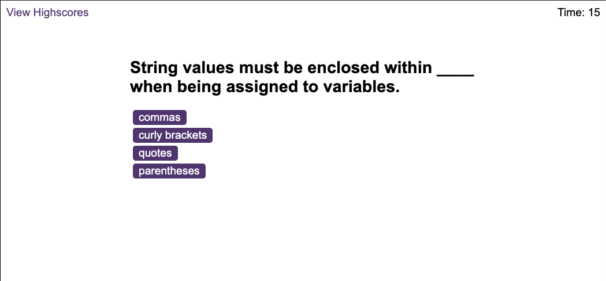
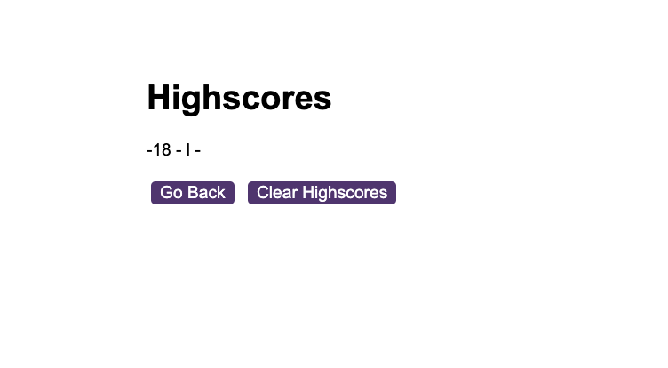

<h1 align="center">Code Quiz

## Description
 Application that quizzes the client on coding questions.
 
## Table of Contents
- [Description](#description)
- [Table of Contents](#table-of-contents)
- [Installation](#installation)
- [Usage](#usage)
- [License](#license)
- [Contributing](#contributing)
- [Tests](#tests)
- [Questions](#questions)
## Installation
 Run index.html

  
 Check out the App here!:https://luisfeliz3.github.io/Code_Quiz/
 

## Usage
 This application will ask coding questions tha will test your skills.

  
## License

  
 
This application is covered by the Open license. 
## Contributing
 Luis Feliz 
## Tests
 n/a
## Questions
 luisfeliz@gmail.com 
 
 GitHub:  
 
 Email me with any questions: luisfeliz@gmail.com  

